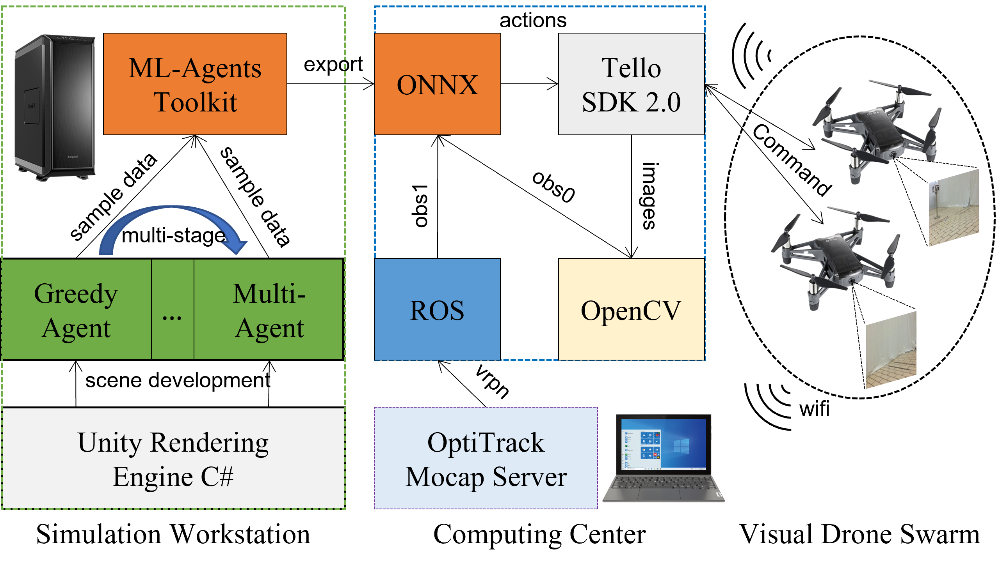
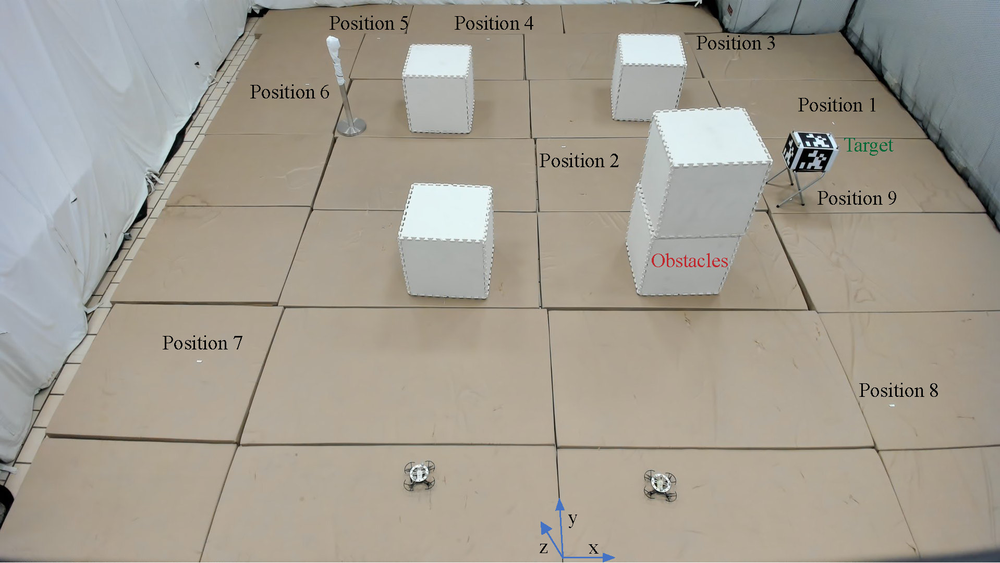

# Collaborative Target Search with a Visual Drone Swarm: An Adaptive Curriculum Embedded Multi-stage Reinforcement Learning Approach
### Official project website for the paper "Collaborative Target Search with a Visual Drone Swarm: An Adaptive Curriculum Embedded Multi-stage Reinforcement Learning Approach"

If you are using the code, please consider giving us a star 🌟 and citing our paper:
```
@article{xiao2022collaborative,
  title={Collaborative Target Search with a Visual Drone Swarm: An Adaptive Curriculum Embedded Multi-stage Reinforcement Learning Approach},
  author={Xiao, Jiaping and Pisutsin, Phumrapee and Feroskhan, Mir},
  journal={arXiv preprint arXiv:2204.12181},
  year={2022}
}
```

**The updated video refers to the [https://youtu.be/jnVLEBWte1U].**

## Pipeline
<div style="text-align: center">

</div>

## Demo
### Environment 1 (Env 1)
<div style="text-align: center">

</div>

### Environment 2 (Env 2)
<div style="text-align: center">

</div>


**Table 1 Target Distribution for Env 2**

|   | position1 | position2 | position3 | position4 | position5 | position6 | position7 | position8 | position9 |
|---|----------:|----------:|----------:|----------:|----------:|----------:|----------:|----------:|----------:|
| x |      2.88 |      0.25 |      1.84 |     -0.45 |     -1.78 |     -2.38 |     -2.38 |      2.08 |      2.05 |
| y |      4.63 |      4.29 |      6.33 |      6.48 |      6.47 |      5.41 |      1.81 |      1.49 |      3.46 |
| z |      0.27 |      0.24 |      0.24 |      0.20 |      0.18 |      0.19 |      0.26 |      0.31 |      0.28 |

<div style="text-align: center">

</div>


## Setup
1. `pip install -r requirements.txt` to set up the dependencies and software requirements. This result of running this command does not include ROS installation. This requirement is tested on an AMD64 architecture device running Ubuntu 20.04 and ROS Noetic.
3. Connect the computing center to the same network used by the OptiTrack Mocap Server. It is recommended that the ethernet cable is used for this connection to avoid using multiple wireless adapters.
4. Configure Motive application on the OptiTrack Mocap Server to stream data related to drones to address location `192.168.1.100`
5. Edit `sample.launch` default launch file of `vrpn_client_ros` (use `roscd vrpn_client_ros && cd launch` to navigate to the launch file) to change the IP address from localhost to `192.168.1.100`, used by the OptiTrack Mocap Server
6. Connect a DJI Tello Edu drone using wireless adapter directly or docker container (please refer to the extra instruction)

## Running Program
1. Navigate to the repository folder
2. Type in the terminal `cd Control`
3. Type in the terminal `python3 single_drone_control.py` for controlling a single drone or `python3 collaborative_two_drones_control.py`for controlling two drones using one computing device for each drone

## Programs List   
1. #### /Models/
    1.1. VisualDrone_single_drone.onnx: Trained neural network model file for single drone target search in ONNX format     
    1.2. VisualDrone_collaborative_drones.onnx: Trained neural network model file for collaborative two drones target search in ONNX format
2. #### /Control/
    2.1. single_drone_control.py: Python script file for controlling the single drone target search using the model in (1.1)      
    2.2. collaborative_two_drones_control.py: Python script file for controlling the collaborative two drones target search using the model in (1.2)    

## System Requirement
1. Ubuntu 18.04 or 20.04
2. AMD architecture device (Strongly recommended, but not required)

## Dependencies and Software Requirements
1. ROS Melodic or Noetic
2. TelloPy library (https://github.com/hanyazou/TelloPy)
3. PyAV library (https://github.com/PyAV-Org/PyAV)
4. vrpn_client_ros ROS 1 Package (http://wiki.ros.org/vrpn_client_ros)
5. ONNX Runtime
6. Torchvision
7. OpenCV
8. PIL library
9. NumPy
